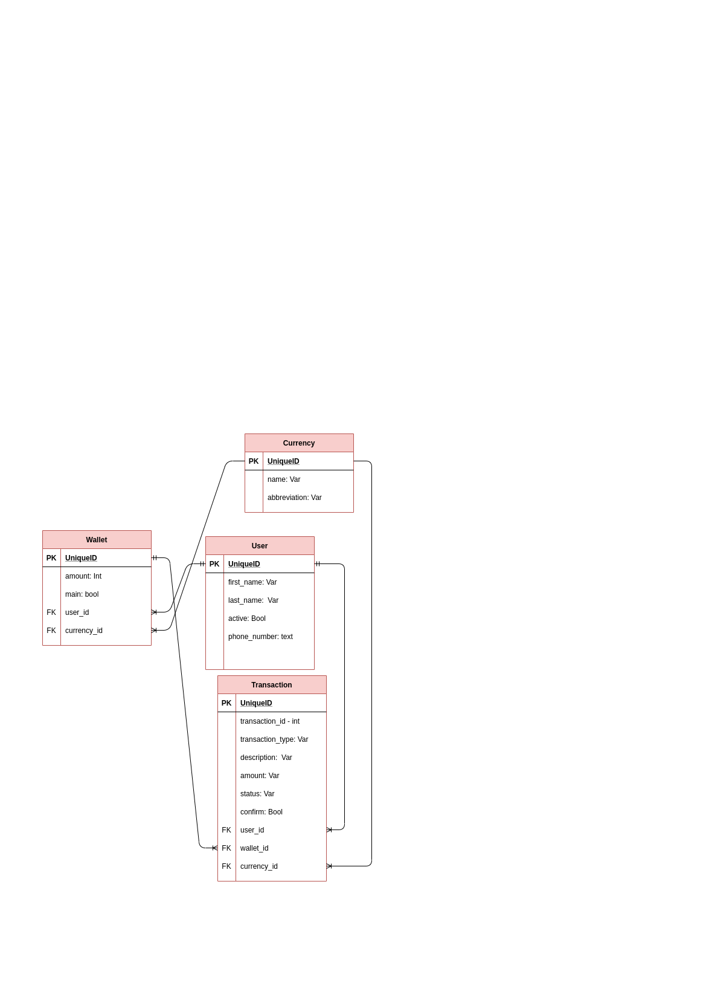

## Dev Placement Project

  <p align="left">
 <a href="https://codeclimate.com/github/kobiyoyo/DevPlaceAssessment/maintainability"></a>
 <a href="https://codeclimate.com/github/kobiyoyo/DevPlaceAssessment/test_coverage"></a>
  </p>

## Database Schema
  

## How to Use
To setup files and the app run
```
docker-compose up
```
Run seed data
```
docker-compose run web rails db:seed
```
Login Details
```
Email: admin@admin.com  Password 01234Admin
```
To run test suite
```
docker-compose run web bundle exec rspec spec/
```
## API Documentation
[Heroku Link]()


## Architecture
- There are four entities created in this project (wallet, user, currency, transactions)
- The transactions entity handles the increment and decrement of wallet amount/balance,for example the amount to increment is gotten from transactions table,then used to increment wallet amount.
- In order to create a main wallet,when signing up you are to provide a currency to create a wallet,the wallet is created automatically once signup is successful ,main wallet can be identified when the main attribute is true.
- Elite and Noob users can signup through the signup link,while admin could be created through seed data. 

## Backend
- Ruby on Rails - the web framework used to build the api .
- Rspec - testing framework
- PostgreSQL -  the main reason PostgreSQL is used , in a case where there is a migration failure while modifying your database records , the entire modification gets rolled back to where you started instead of crashing like  MySQL.
- RSpec API Doc Generator - for api documentation


## Requirements

#### Noob
- [x] Can only have a wallet in a single currency selected at signup (main).
- [x] All wallet funding in a different currency should be converted to the main currency.
- [x] All wallet withdrawals in a different currency should be converted to the main currency before transactions are approved.
- [x] All wallet funding has to be approved by an administrator.
- [x] Cannot change main currency.

#### Elite
- [x] Can have multiple wallets in different currencies with a main currency selected at signup.
- [x] Funding in a particular currency should update the wallet with that currency or create it.
- [x] Withdrawals in a currency with funds in the wallet of that currency should reduce the wallet balance for that currency.
- [x] Withdrawals in a currency without a wallet balance should be converted to the main currency and withdrawn.
- [x] Cannot change main currency

#### Admin
- [x] Cannot have a wallet.
- [x] Cannot withdraw funds from any wallet.
- [x] Can fund wallets for Noob or Elite users in any currency.
- [x] Can change the main currency of any user.
- [x] Approves wallet funding for Noob users.
- [x] Can promote or demote Noobs or Elite users


#### Other Requirements
- [x] Write concise api documentation for your endpoints
- [ ] Write tests to cover all scenarios that you implement(I couldnt test service objects,due to time constraints)
- [x] Write a docker-compose file to startup your application and start your db


#### Note Errors:
Please kindly note, I get this error whenever i try to run my test suite
```
 FATAL:  could not open file "global/pg_filenode.map": Permission denied

```
